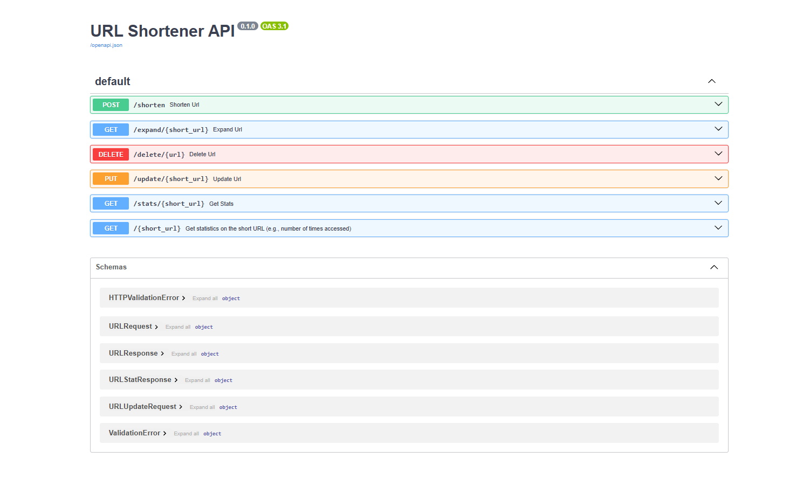

# <a href="https://roadmap.sh/projects/url-shortening-service">URL Shortener API</a>



A simple URL shortening service built with FastAPI and SQLite.

## Features

- 🔗 Shorten long URLs
- 🌐 Redirect from short URLs
- 📝 Update original long URLs
- 🗑️ Delete shortened URLs
- 📊 Track visit statistics for each short URL

## Technologies

- Python
- FastAPI
- SQLAlchemy
- SQLite

## Setup

1. **Clone the repository**:
   ```bash
   git clone https://github.com/ShrooqAyman/URL-Shortening-Service.git
   
2. **Create a virtual environment**:
```bash
python -m venv venv
.\venv\Scripts\activate
```

3. **Install dependencies**:
```bash
pip install -r requirements.txt
```

4. **Run the application**:
```bash
uvicorn app.main:app --reload
```
5. **Open in browser**: Navigate to http://localhost:8000/docs to access the interactive API documentation.

## API Endpoints
- POST /shorten - Create a new short URL

- GET /expand/{short_url} - Get the original URL

- PUT /update/{short_url} - Update the long URL

- DELETE /delete/{url} - Delete a short URL

- GET /stats/{short_url} - Get usage statistics

